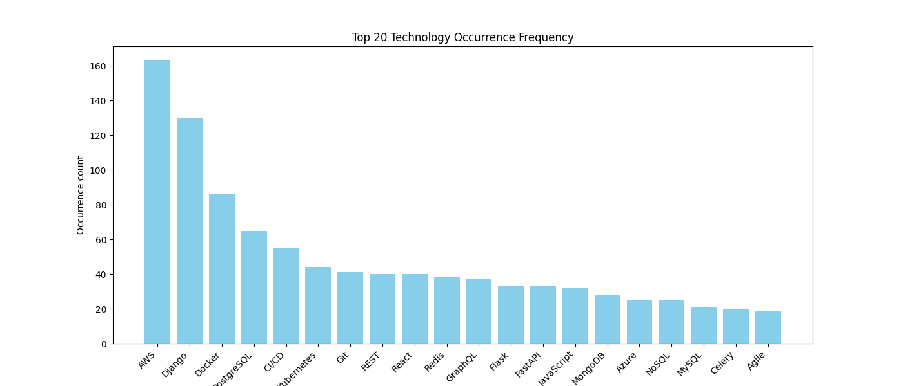

# Analysis job technologies
 Parser of public information about vacancies for Python developer from site `Djinni.co`, save into csv file and analyse this information and creation graphics.

## How diagram looks like


## Key Features

1. **Asynchronous Parsing with asyncio:**
   Enable asynchronous data parsing using the asyncio library for efficient resource utilization and improved performance.

2. **Optimized Processing:**
   Utilize optimized algorithms to reduce the number of requests and optimize resource usage, ensuring efficient data processing.

3. **Thoughtful Data Analysis:**
   Employ carefully crafted strategies for data analysis, enabling comprehensive and meaningful insights from data processing.

## Getting Started

To set up and run the project locally, follow these steps:


1. **Clone the Repository:**
    ```bash
    git clone https://github.com/AnyoneClown/djinni-scraping.git
    ```

2. **Install Dependencies:**
    ```bash
    pip install -r requirements.txt
    ```
3. **Open file `main.py` in folder `scraping` and run the project**
4. **File `vacancies.csv` will be generated with data in folder `scraping`**
5. **To display the graphs, open the file `analisys.ipynb` file in `data analysis` folder and click `Run All`**


## Contributing

I welcome contributions to make this project even better. If you're interested in contributing, here's a step-by-step guide:

1. **Fork the Repository:**
   Click the "Fork" button on the top right of the repository's page to create your own fork.

2. **Create a New Branch:**
   Create a new branch for your feature or bug fix. Be descriptive with your branch name.

3. **Implement Your Changes:**
   Make your changes to the codebase. Ensure your code adheres to the project's coding standards.

4. **Test Thoroughly:**
   Test your changes rigorously to ensure they work as expected.

5. **Submit a Pull Request:**
   When ready, submit a pull request with details about your changes. Provide a clear and concise explanation of the problem and solution.
